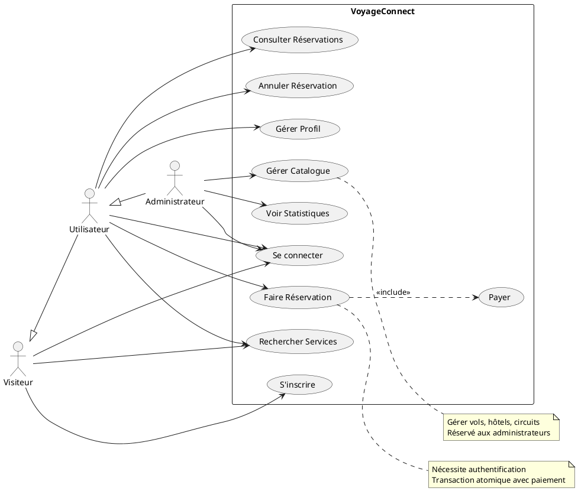
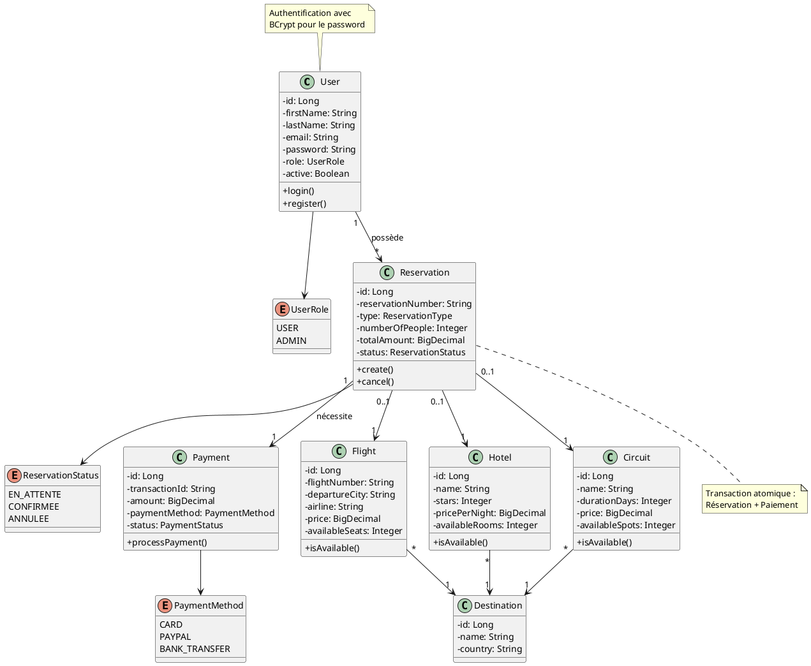
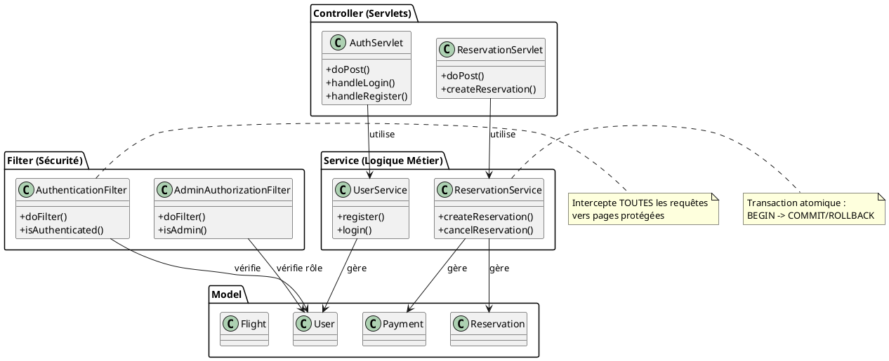
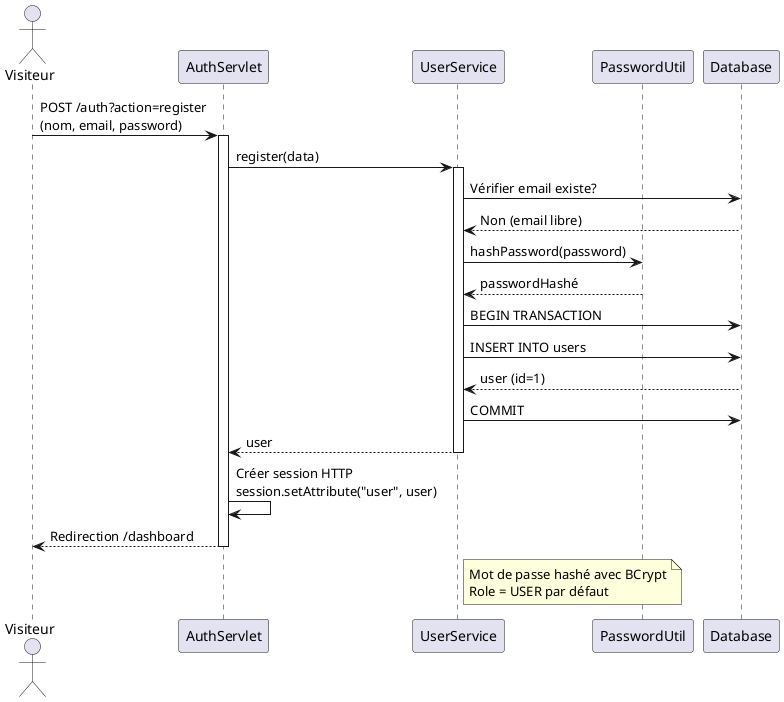
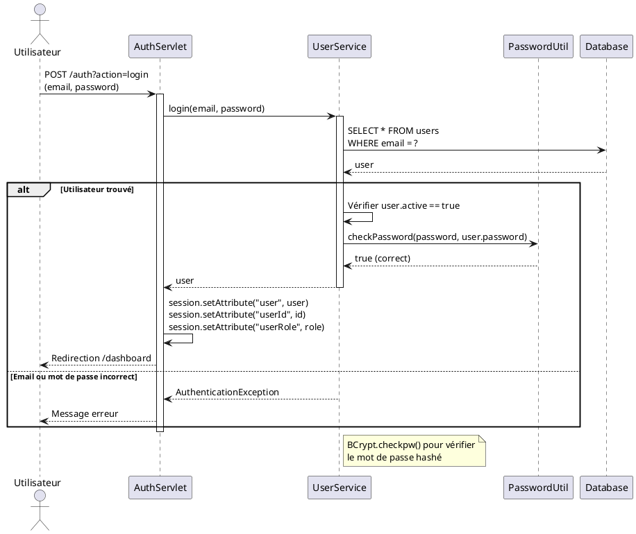
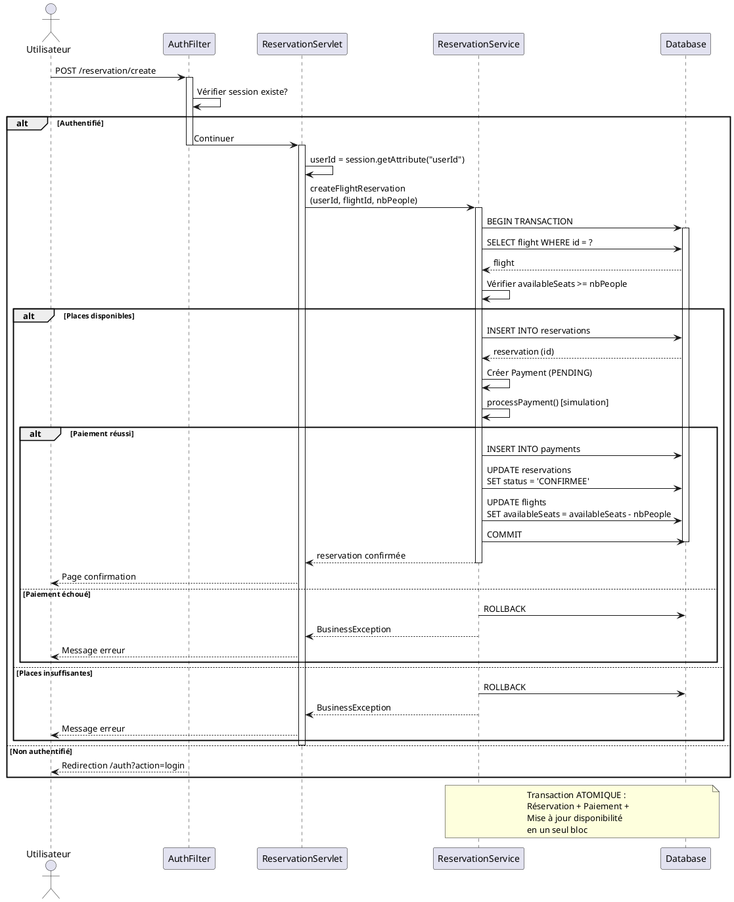
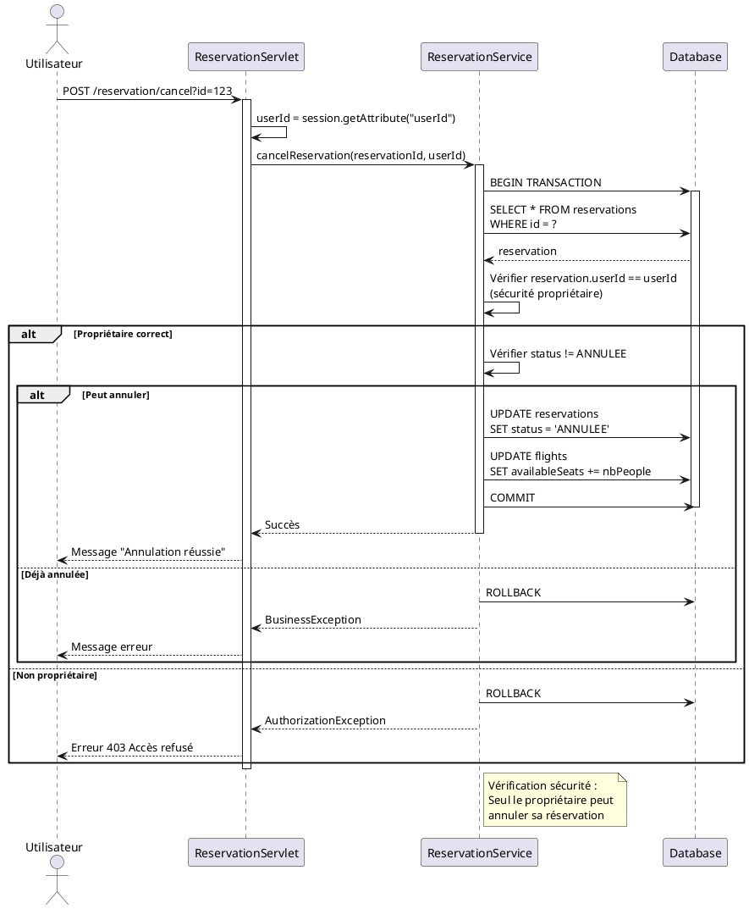
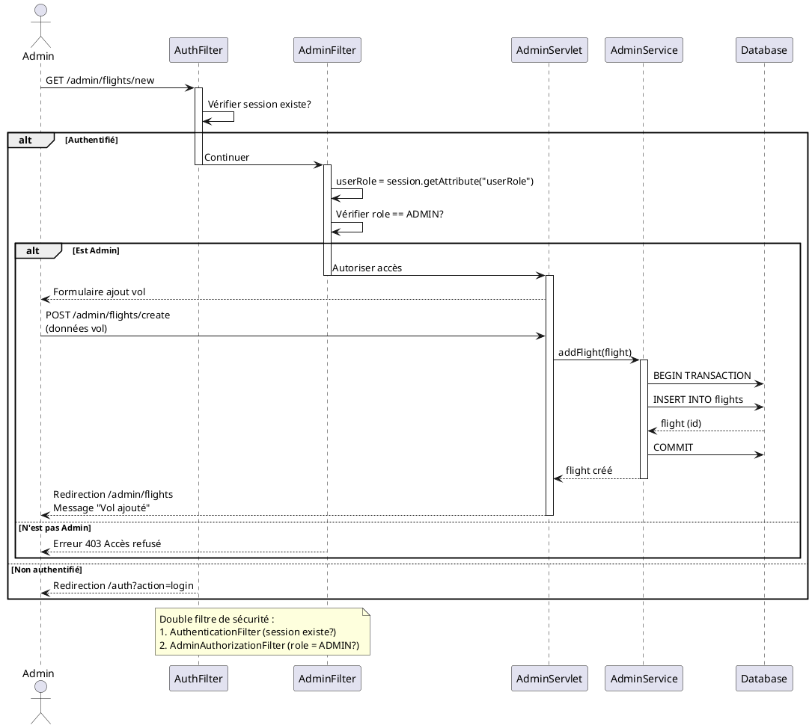
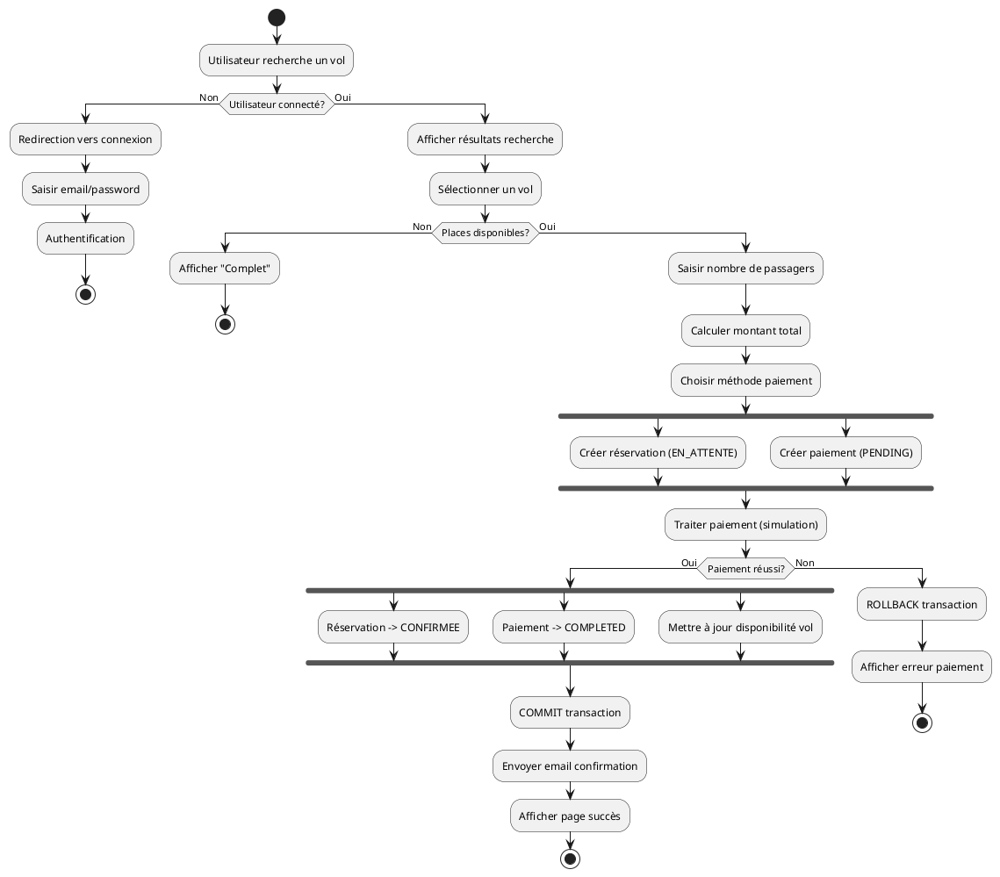
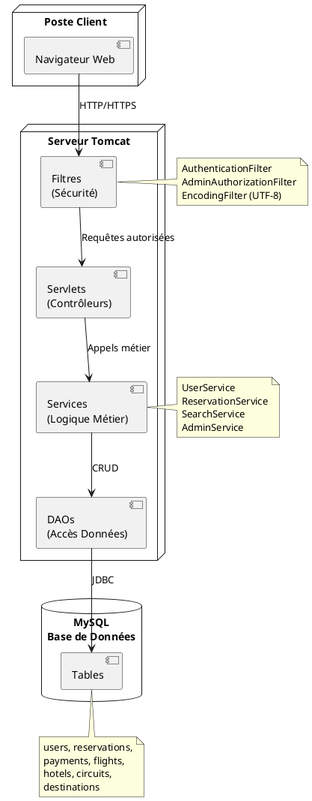

# Diagrammes PlantUML - VoyageConnect (Simplifiés)

## Comment visualiser ces diagrammes

### Méthode 1 : Extension VS Code
1. Installer l'extension **PlantUML** (par jebbs)
2. Installer **Java** (requis pour PlantUML)
3. Appuyer sur `Alt+D` pour prévisualiser le diagramme sous le curseur

### Méthode 2 : En ligne
Copier le code et coller sur : http://www.plantuml.com/plantuml/uml/

### Méthode 3 : Exporter en image
- Dans VS Code : Clic droit sur le diagramme → Export Current Diagram → PNG/SVG

---

## 1. Diagramme de Cas d'Utilisation



---

## 2. Diagramme de Classes (Simplifié - Entités Principales)



---

## 3. Diagramme de Classes - Architecture MVC (Simplifié)



---

## 4. Diagramme de Séquence - Inscription (Simplifié)



---

## 5. Diagramme de Séquence - Connexion (Simplifié)



---

## 6. Diagramme de Séquence - Réservation Vol avec Authentification (Simplifié)



---

## 7. Diagramme de Séquence - Annulation Réservation (Simplifié)



---

## 8. Diagramme de Séquence - Administration (Ajout Vol) (Simplifié)



---

## 9. Diagramme d'Activité - Processus Réservation Complète (Bonus)



---

## 10. Diagramme de Déploiement (Architecture Physique) (Bonus)



---

## Résumé des Simplifications

### ✅ Ce qui a été gardé (Essentiel)
- **Authentification** : Login, Register avec BCrypt
- **Filtres de sécurité** : AuthenticationFilter, AdminAuthorizationFilter
- **Transactions atomiques** : BEGIN/COMMIT/ROLLBACK
- **Relations principales** : User-Reservation-Payment-Flight
- **Flux critiques** : Réservation avec paiement

### ❌ Ce qui a été retiré (Détails)
- Classes DAO individuelles (regroupées)
- Tous les enums secondaires
- Méthodes auxiliaires
- Validations détaillées
- EmailUtil, ValidationUtil (mentionnés mais pas détaillés)
- Review, Promotion (entités secondaires)

### 📊 Avantages de PlantUML vs Mermaid
- ✅ Rendu plus professionnel et lisible
- ✅ Export facile en PNG/SVG/PDF
- ✅ Meilleure gestion des notes et annotations
- ✅ Syntaxe plus standard UML
- ✅ Diagrammes d'activité et de déploiement disponibles

### 🎨 Pour personnaliser l'apparence
Ajouter au début de chaque diagramme :
```plantuml
skinparam backgroundColor #FEFEFE
skinparam classBackgroundColor #E8F5E9
skinparam classBorderColor #4CAF50
skinparam arrowColor #1976D2
```

Les diagrammes sont maintenant **simplifiés et concentrés sur l'essentiel** ! 🚀
